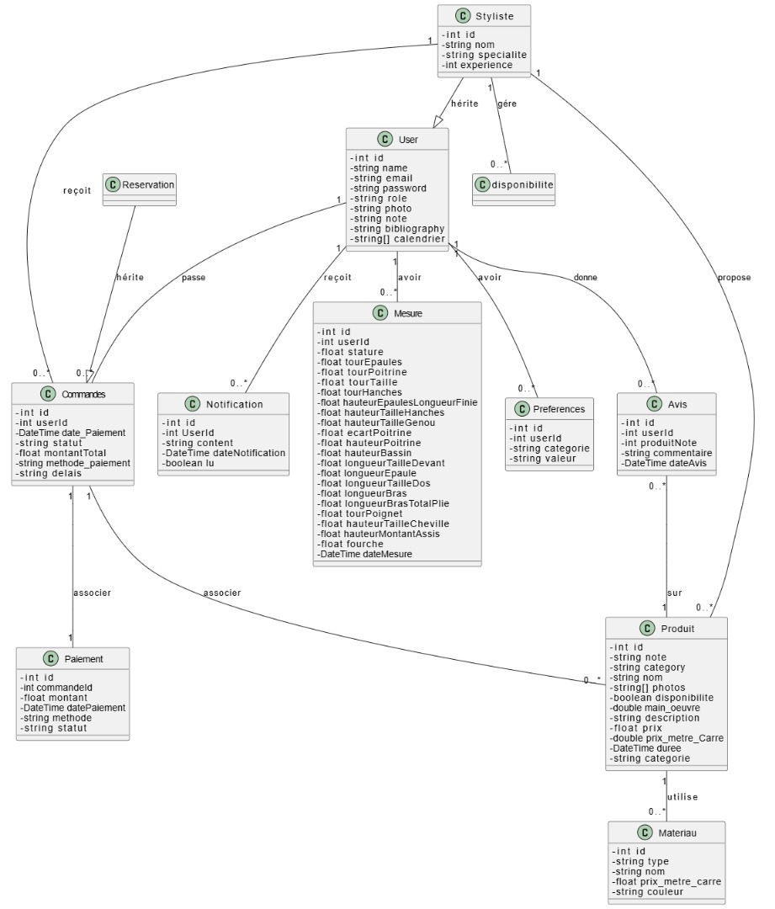

# API Documentation

This project provides a comprehensive API for managing various entities. Each entity has its own detailed documentation, available through the links below. The overall database schema can be accessed via the image `modeling.jpeg`.

## Table of Contents

### Authentication
- [Authentication Documentation](./Authentication.md)
  - POST /api/auth/login: User login.
  - POST /api/auth/register: User registration.
  - POST /api/auth/logout: User logout.

### Command
- [Command Documentation](./Command.md)
  - GET /api/commands: Retrieve all commands.
  - GET /api/commands/{id}: Retrieve a specific command.
  - POST /api/commands: Create a new command.
  - PUT /api/commands/{id}: Update an existing command.
  - DELETE /api/commands/{id}: Delete a command.

### Material
- [Material Documentation](./Material.md)
  - GET /api/materials: Retrieve all materials.
  - GET /api/materials/{id}: Retrieve a specific material.
  - POST /api/materials: Create a new material.
  - PUT /api/materials/{id}: Update an existing material.
  - DELETE /api/materials/{id}: Delete a material.

### Measure
- [Measure Documentation](./Measure.md)
  - GET /api/measures: Retrieve all measures.
  - GET /api/measures/{id}: Retrieve a specific measure.
  - POST /api/measures: Create a new measure.
  - PUT /api/measures/{id}: Update an existing measure.
  - DELETE /api/measures/{id}: Delete a measure.

### Notification
- [Notification Documentation](./Notification.md)
  - GET /api/notifications: Retrieve all notifications.
  - GET /api/notifications/{id}: Retrieve a specific notification.
  - POST /api/notifications: Create a new notification.
  - PUT /api/notifications/{id}: Update an existing notification.
  - DELETE /api/notifications/{id}: Delete a notification.

### Payment
- [Payment Documentation](./Payment.md)
  - GET /api/payments: Retrieve all payments.
  - GET /api/payments/{id}: Retrieve a specific payment.
  - POST /api/payments: Create a new payment.
  - PUT /api/payments/{id}: Update an existing payment.
  - DELETE /api/payments/{id}: Delete a payment.

### Preference
- [Preference Documentation](./Preference.md)
  - GET /api/preferences: Retrieve all preferences.
  - GET /api/preferences/{id}: Retrieve a specific preference.
  - POST /api/preferences: Create a new preference.
  - PUT /api/preferences/{id}: Update an existing preference.
  - DELETE /api/preferences/{id}: Delete a preference.

### Product
- [Product Documentation](./Product.md)
  - GET /api/products: Retrieve all products.
  - GET /api/products/{id}: Retrieve a specific product.
  - POST /api/products: Create a new product.
  - PUT /api/products/{id}: Update an existing product.
  - DELETE /api/products/{id}: Delete a product.

### Review
- [Review Documentation](./Review.md)
  - GET /api/reviews: Retrieve all reviews.
  - GET /api/reviews/{id}: Retrieve a specific review.
  - POST /api/reviews: Create a new review.
  - PUT /api/reviews/{id}: Update an existing review.
  - DELETE /api/reviews/{id}: Delete a review.

### User
- [User Documentation](./User.md)
  - GET /api/users: Retrieve all users.
  - GET /api/users/{id}: Retrieve a specific user.
  - POST /api/users: Create a new user.
  - PUT /api/users/{id}: Update an existing user.
  - DELETE /api/users/{id}: Delete a user.
